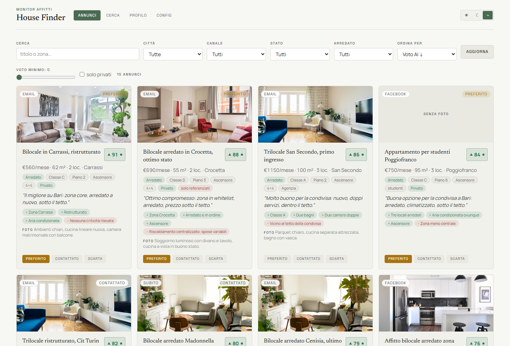
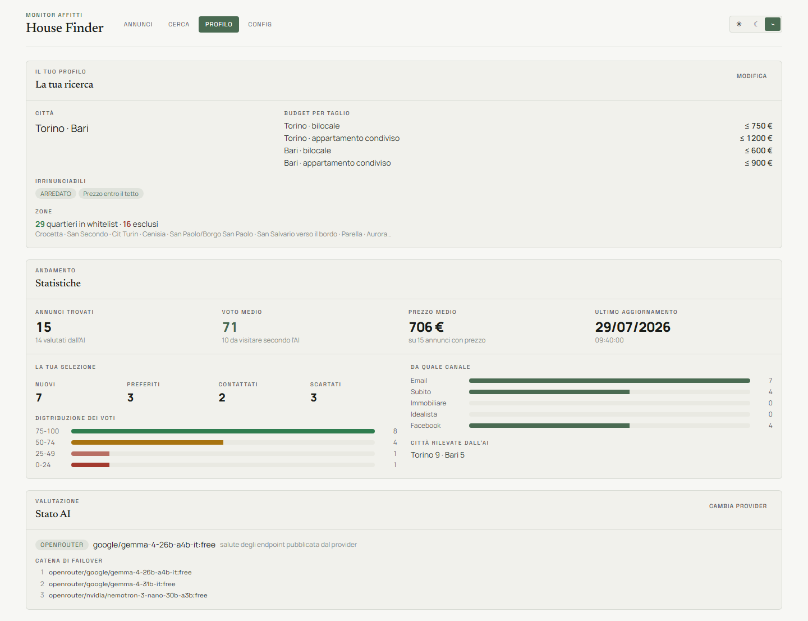
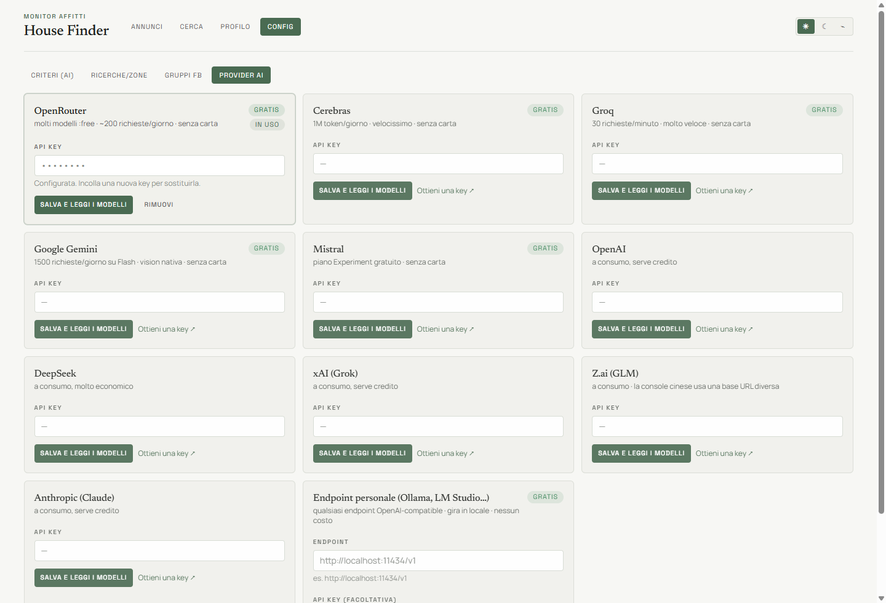
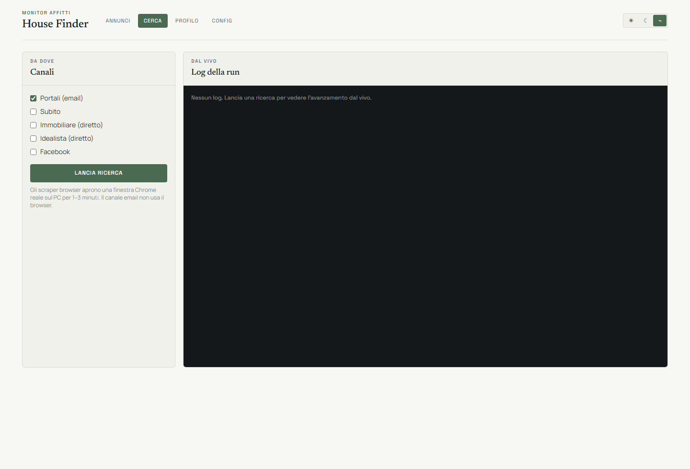

# 🏠 House Finder

> Multi-channel rental listing monitor: it collects flats from portals, classifieds and Facebook,
> lets an **LLM score each one against your own criteria**, and shows the result in a local dashboard
> where you mark favourites, contacted and discarded. Local-first — your data never leaves your machine.

[](https://github.com/DiegoRiccardi1234/house-finder/actions/workflows/tests.yml)


[](LICENSE)
[](CHANGELOG.md)
[](https://github.com/DiegoRiccardi1234/house-finder/releases/latest)

**[🇬🇧 English](#-english) · [🇮🇹 Italiano](#-italiano)**

<p align="center">
  
</p>

<p align="center">
  
</p>

<p align="center">
  
  &nbsp;
  
</p>

---

## 🇬🇧 English

Looking for a flat means reading the same listings over and over across five different sites, most of
them irrelevant. House Finder collects them for you, hands every listing to an LLM together with your
criteria written in plain language, and gives you back a **0-100 score, pros, cons and a "worth a
visit?" verdict** — plus a dashboard to track what you already contacted or discarded.

### ✨ Features

- **Five channels, one archive** — portal emails (IMAP), Subito, Immobiliare, Idealista and Facebook
  (groups + Marketplace) are normalised into a single deduplicated store.
- **Criteria in plain language** — no rule DSL: you write what you want in `data/criteria.md`
  (budget, must-haves, neighbourhood whitelist), the model does the judging.
- **One AI call per batch** — `scoreBatch` sends ~10 listings per request and extracts *normalised
  fields* (furnished, floor, lift, energy class, tenant constraints, contact type) **and** the score
  in the same call. Every field is `zod` + `.catch(null)`: a malformed free-tier JSON degrades a
  single field instead of failing the run.
- **Eleven LLM providers, one interface** — OpenRouter, Cerebras, Groq, Google Gemini, Mistral,
  OpenAI, Anthropic, DeepSeek, xAI, Z.ai, plus a **custom** OpenAI-compatible endpoint that covers
  Ollama and LM Studio. Keys are entered in the UI and stored in `data/local/` — the server never
  sends them back to the browser. Failover tries other models on the same host first, then other
  providers.
- **Profile tab** — what the app is doing for you: your criteria in plain sight, how many listings
  per channel and status, score distribution, and which model is answering right now.
- **Automatic, health-aware model selection** — before using a model the app queries OpenRouter's
  `/endpoints` (free, no inference, no quota), ranks the healthy ones by uptime band, prefers the
  26-40B instruct sweet spot over giants that truncate, applies **sticky empirical penalties**
  (`finish_reason=length`, empty answers, 429) and fails over down the chain. No model name to pick
  by hand — see [AI model selection](#ai-model-selection).
- **Durable by design** — atomic writes with `.bak`, fail-loud loading (never a silent wipe),
  per-channel isolation with incremental saves, store mutex.
- **Local web dashboard** — React + Tailwind: filters, live run log over SSE, favourite / contacted /
  discarded, in-app config editor, one-click archive cleanup.
- **Tested** — 135 tests (`node:test`), `tsc --strict` on both the server and the UI, CI on Node 20 and 22.

### 📡 Channels

| Channel | How | Notes |
|---|---|---|
| **Portal emails** | saved searches on the portals → e-mail → read over **IMAP** | browserless, the most reliable one |
| **Subito** | headed browser, reads `__NEXT_DATA__` | desktop only |
| **Immobiliare** | headed browser, reads `__NEXT_DATA__` | desktop only |
| **Idealista** | headed browser, DOM + detail page fetch | desktop only |
| **Facebook** | groups + Marketplace on your own logged-in browser session | optional, see below |

Why e-mail too: the portals publish **saved searches with instant e-mail alerts** for free. Reading
your own inbox is cheaper, more stable and friendlier than hitting the site, so it stays the primary
channel; the browser scrapers complement it.

**About the Facebook channel.** It is optional and off unless you enable it. It reuses *your* browser
session (the app never asks for credentials and stores no password), requires you to join the groups
manually — private groups show nothing to non-members — and runs at human scale on your own machine.
The shipped `data/facebook.json` contains placeholder group URLs: put yours in there.

### 🚀 Quickstart

```powershell
git clone https://github.com/DiegoRiccardi1234/house-finder.git
cd house-finder
npm install
npm run ui:install
copy .env.example .env      # then fill in IMAP + OPENROUTER_API_KEY
npm start                   # → http://localhost:3000
```

Node 20+. For the browser channels: `npx playwright install chromium`.

Prefer not to install anything? Grab `HouseFinder-windows.zip` from the
[latest release](https://github.com/DiegoRiccardi1234/house-finder/releases/latest), unzip the
`HouseFinder` folder wherever you like, double-click **`HouseFinder.exe`**. No console window: the
app lives in a **tray icon** (open · copy address · quit). Everything else sits in `app\`, out of
the way. `app\avvio-con-console.bat` starts the same server with a visible window when something
refuses to start; either way the log is in `state\logs\house-finder.log`. The bundle ships Node but **not** the
Playwright browsers (~400 MB): without them the app runs in e-mail-only mode — the dashboard shows the
scraper channels as unavailable — and `install-browsers.bat` enables the rest.

**Updates** live in *Config → App*: it checks the latest GitHub release and, one button later,
downloads it, replaces the files and restarts itself. Your archive, `.env` and personal config are
never touched. If an update ever fails, `state\logs\updater.log` names the file that stayed locked
(usually antivirus) — and re-downloading the ZIP and unzipping it over the folder is always a valid
recovery path, since it is exactly what the updater does.

### 🔑 Configuration

**Everything is in the interface — no terminal, no editing files.** *Config* holds the mailbox
credentials (with a real connection test), the AI provider keys and the model choice, the Facebook
sign-in, the search criteria and zones, and a button to install the browsers. Nothing there requires
a shell, which is the point: the app is meant to be usable by someone who unzipped it and
double-clicked.

`.env` still works and is read as a fallback (see `.env.example`): IMAP host/user/password,
`OPENROUTER_API_KEY`, optional Telegram notifications (off by default — the dashboard is the
output). Anything set in the UI wins over it.

Search config lives in `data/` and can be edited by hand or from the **Config** tab:

| File | What |
|---|---|
| `data/criteria.md` | your criteria in plain language — this is what the model reads |
| `data/searches.json` | search profiles: city, price cap, number of rooms |
| `data/facebook.json` | groups and Marketplace targets |

**Two layers.** The files in `data/` are versioned examples. Anything in `data/local/` — gitignored —
wins on read, and **every write from the UI goes there**. So your real budget and neighbourhoods stay
out of the repository even if you edit them from the dashboard. See `src/config/paths.ts`.

### 🧠 AI model selection

Free-tier models are unreliable in a specific way: the big reasoning ones burn the token budget on
hidden chain-of-thought and **truncate the JSON**, which `JSON.parse` sometimes still accepts (outer
object closed, array short) — a silent failure. `src/ai/endpoint-health.ts` deals with it:

1. **Live health** — `GET /models/{slug}/endpoints`, free and inference-less: a model with zero
   endpoints is dead, one below the uptime threshold is skipped.
2. **Uptime bands** (~2%) instead of raw ordering, so a better model is not overtaken over noise.
3. **Size tier** — quality floor ~26B, sweet spot 26-40B; the 120B/550B giants sink to the bottom.
4. **Sticky empirical penalties** — whoever truncates (`finish_reason=length`), answers empty or 429s
   gets demoted per `(provider, model)` for the rest of the task. Slugs don't tell you which model is
   a reasoning one, so it is learned at runtime.
5. **Chained failover**, then a heuristic fallback if everything fails.

`npm run try:health` prints the resulting chain without spending any quota.

### 🧱 Architecture

```
channels ──► pipeline (dedup + AI) ──► ListingStore ──► Express API ──► React UI
 email / subito / immobiliare        state/listings.json     /api/*         :3000
 idealista / facebook
```

- `src/core/pipeline.ts` — orchestration, isolated per channel, incremental save, injectable log.
- `src/core/store.ts` + `src/core/atomic.ts` — persistence, atomic write + `.bak`, resilient load.
- `src/core/thumbs.ts` — thumbnails are **copied to disk** during a run (`state/thumbs/`, gitignored).
  Facebook photo URLs are signed and expire within days, Subito's need a `?rule=` parameter and both
  block hotlinking: keeping the remote URL means empty cards a week later. The local copy also feeds
  the vision stage as base64, which is the only form every provider accepts.
- `src/ai/score.ts` — batch scoring, field extraction, `finish_reason` handling, failover.
- `src/ai/endpoint-health.ts` — model ranking and penalties.
- `src/sources/` — one adapter per channel, each testable in isolation.
- `src/server/` — API, SSE run log, image proxy with host allowlist (anti-SSRF), CSRF and
  prototype-pollution guards, bound to `127.0.0.1`.
- `ui/` — Vite + React + Tailwind.

### 🖥️ CLI & diagnostics

```powershell
npm run try:health          # chosen model chain + health + size (no quota spent)
npm run try:score           # score two sample listings end to end
npm run try:email           # read unread mail, print extracted listings (non-destructive)
npm run try:source -- <portal> <profile>   # single scraper, headed
npm run debug:page -- <portal> <profile>   # dump HTML to tune selectors
npm run monitor             # CLI run (e-mail; + scrapers with ENABLE_SCRAPERS=1)
npm run fix:thumbs          # re-download the thumbnails of listings already in the archive
npm run docs:shots          # regenerate the README screenshots from the demo dataset
npm test                    # 147 tests
npm run typecheck           # tsc --noEmit (and: npm --prefix ui run typecheck)
```

### ✅ Tests & CI

`node:test` covers parsing (one suite per portal), dedup and store durability, the pipeline, the HTTP
API (supertest), the Facebook noise filter, model ranking and the local-config override. CI runs
type-check + tests on Node 20 and 22.

### ⚠️ Disclaimer

Personal tool, built for one person's flat hunt. It runs on your machine, at human pace, on the
accounts and sessions you already own. Respect the terms of service of the sites you point it at;
don't use it at scale or commercially. Listings collected locally may contain third-party personal
data (names, phone numbers): they stay in `state/`, which is gitignored — keep it that way.

### 📄 License

MIT — see [LICENSE](LICENSE).

---

## 🇮🇹 Italiano

Cercare casa vuol dire rileggere gli stessi annunci su cinque siti diversi, quasi tutti fuori target.
House Finder li raccoglie al posto tuo, passa ogni annuncio a un LLM insieme ai tuoi criteri scritti
in italiano normale, e ti restituisce **voto 0-100, pro, contro e un verdetto "vale una visita?"** —
più una dashboard per tenere traccia di chi hai già contattato o scartato.

### ✨ Funzionalità

- **Cinque canali, un solo archivio** — mail dei portali (IMAP), Subito, Immobiliare, Idealista e
  Facebook (gruppi + Marketplace) normalizzati in un archivio unico deduplicato.
- **Criteri in linguaggio naturale** — nessun DSL di regole: scrivi cosa cerchi in `data/criteria.md`
  (budget, must-have, whitelist quartieri), a giudicare ci pensa il modello.
- **Una chiamata AI per gruppo** — `scoreBatch` manda ~10 annunci per richiesta ed estrae i **campi
  normalizzati** (arredato, piano, ascensore, classe energetica, vincoli inquilino, tipo contatto)
  **e** il voto nella stessa chiamata. Ogni campo è `zod` + `.catch(null)`: un JSON sporco del free
  tier degrada un singolo campo invece di far fallire il run.
- **Undici provider LLM, una sola interfaccia** — OpenRouter, Cerebras, Groq, Google Gemini,
  Mistral, OpenAI, Anthropic, DeepSeek, xAI, Z.ai, più un endpoint **personale** OpenAI-compatible
  che copre Ollama e LM Studio. Le key si inseriscono dalla UI e restano in `data/local/`: il
  server non le rimanda mai al browser. Il failover prova prima altri modelli dello stesso host,
  poi gli altri provider.
- **Tab Profilo** — cosa sta facendo l'app per te: i tuoi criteri in chiaro, quanti annunci per
  canale e per stato, la distribuzione dei voti, e quale modello sta rispondendo adesso.
- **Selezione modelli automatica e health-aware** — prima di usare un modello l'app interroga
  `/endpoints` di OpenRouter (gratis, nessuna inferenza, nessuna quota), ordina i sani a fasce di
  uptime, preferisce lo sweet spot 26-40B instruct ai giganti che troncano, applica **penalità
  empiriche sticky** (`finish_reason=length`, risposte vuote, 429) e fa failover a catena. Nessun
  nome di modello da scegliere a mano — vedi [Selezione dei modelli](#selezione-dei-modelli).
- **Durabilità** — scrittura atomica con `.bak`, load fail-loud (mai un wipe silenzioso), canali
  isolati con save incrementale, mutex sullo store.
- **Dashboard web locale** — React + Tailwind: filtri, log del run dal vivo via SSE, preferiti /
  contattati / scartati, editor della config, pulizia dell'archivio in un click.
- **Testato** — 135 test (`node:test`), `tsc --strict` su server e UI, CI su Node 20 e 22.

### 📡 Canali

| Canale | Come | Note |
|---|---|---|
| **Mail dei portali** | ricerche salvate → mail → lette via **IMAP** | senza browser, il più affidabile |
| **Subito** | browser headed, legge `__NEXT_DATA__` | solo PC |
| **Immobiliare** | browser headed, legge `__NEXT_DATA__` | solo PC |
| **Idealista** | browser headed, DOM + fetch della pagina di dettaglio | solo PC |
| **Facebook** | gruppi + Marketplace sulla tua sessione browser | opzionale, vedi sotto |

Perché anche la mail: i portali offrono gratis le **ricerche salvate con notifica immediata**. Leggere
la propria casella costa meno, è più stabile ed è più educato che martellare il sito — resta quindi il
canale principale, gli scraper lo completano.

**Sul canale Facebook.** È opzionale e spento finché non lo attivi. Riusa la *tua* sessione browser
(l'app non chiede credenziali e non salva password), richiede che tu abbia joinato i gruppi a mano — i
gruppi privati non mostrano nulla ai non-membri — e gira a ritmo umano sulla tua macchina. Il
`data/facebook.json` incluso ha URL segnaposto: mettici i tuoi.

### 🚀 Avvio rapido

```powershell
git clone https://github.com/DiegoRiccardi1234/house-finder.git
cd house-finder
npm install
npm run ui:install
copy .env.example .env      # poi compila IMAP + OPENROUTER_API_KEY
npm start                   # → http://localhost:3000
```

Serve Node 20+. Per i canali browser: `npx playwright install chromium`.

Non vuoi installare niente? Scarica `HouseFinder-windows.zip` dalla
[release più recente](https://github.com/DiegoRiccardi1234/house-finder/releases/latest), estrai la
cartella `HouseFinder` dove preferisci e fai doppio click su **`HouseFinder.exe`**. Nessuna
finestra: l'app vive in un'**icona nell'area di notifica** (apri · copia indirizzo · esci). Tutto il
resto sta in `app\`, fuori dai piedi. `app\avvio-con-console.bat` avvia lo stesso server con la
finestra visibile, utile quando qualcosa non parte; in ogni caso il log è in
`state\logs\house-finder.log`. Il bundle
include Node ma **non** i browser Playwright (~400 MB): senza quelli l'app parte in modalità
solo-email — la dashboard mostra i canali scraper come non disponibili — e `install-browsers.bat`
abilita il resto.

**Gli aggiornamenti** stanno in *Config → App*: controlla l'ultima release su GitHub e, con un
pulsante, la scarica, sostituisce i file e si riavvia da solo. Archivio, `.env` e configurazione
personale non vengono toccati. Se un aggiornamento fallisce, `state\logs\updater.log` dice **quale**
file è rimasto bloccato (di solito l'antivirus) — e riscaricare lo ZIP ed estrarlo sopra la cartella
resta sempre una via di recupero valida, perché è esattamente quello che fa l'aggiornatore.

### 🔑 Configurazione

**Tutto si fa dall'interfaccia — niente terminale, niente file da modificare.** In *Config* stanno le
credenziali della casella email (con prova di connessione vera), le key dei provider AI e la scelta
del modello, l'accesso a Facebook, i criteri di ricerca e le zone, e un pulsante per installare i
browser. Niente lì dentro richiede una riga di comando, ed è il punto: l'app deve essere usabile da
chi ha estratto uno zip e ha fatto doppio click.

Il `.env` funziona ancora e viene letto come ripiego (vedi `.env.example`): host/utente/password
IMAP, `OPENROUTER_API_KEY`, notifiche Telegram opzionali (spente di default — l'output è la
dashboard). Quello che imposti nella UI vince su di lui.

La config di ricerca sta in `data/`, modificabile a mano o dal tab **Config**:

| File | Cosa |
|---|---|
| `data/criteria.md` | i tuoi criteri in linguaggio naturale — è quello che legge il modello |
| `data/searches.json` | profili di ricerca: città, tetto di prezzo, numero di locali |
| `data/facebook.json` | gruppi e target Marketplace |

**Due livelli.** I file in `data/` sono esempi versionati. Quelli in `data/local/` — gitignorato —
vincono in lettura, e **tutte le scritture della UI finiscono lì**. Così il tuo budget vero e i tuoi
quartieri restano fuori dal repository anche se li modifichi dalla dashboard. Vedi
`src/config/paths.ts`.

### Selezione dei modelli

I modelli free sono inaffidabili in un modo preciso: i reasoning grossi bruciano il budget di token in
chain-of-thought nascosta e **troncano il JSON**, che a volte `JSON.parse` accetta lo stesso (oggetto
esterno chiuso, array corto) — un fallimento silenzioso. `src/ai/endpoint-health.ts` lo affronta così:

1. **Salute live** — `GET /models/{slug}/endpoints`, gratis e senza inferenza: modello con zero
   endpoint = morto, sotto soglia di uptime = scartato.
2. **Fasce di uptime** (~2%) invece dell'ordinamento grezzo, così un modello migliore non viene
   scavalcato per rumore statistico.
3. **Taglia** — quality floor ~26B, sweet spot 26-40B; i giganti 120B/550B finiscono in fondo.
4. **Penalità empiriche sticky** — chi tronca (`finish_reason=length`), risponde vuoto o dà 429 viene
   deprioritizzato per `(provider, modello)` per il resto del task. Gli slug non dicono quale modello
   è reasoning: lo si impara a runtime.
5. **Failover a catena**, più un fallback euristico se fallisce tutto.

`npm run try:health` stampa la catena scelta senza consumare quota.

### 🧱 Architettura

```
canali ──► pipeline (dedup + AI) ──► ListingStore ──► API Express ──► UI React
 email / subito / immobiliare      state/listings.json     /api/*        :3000
 idealista / facebook
```

- `src/core/pipeline.ts` — orchestrazione, isolata per canale, save incrementale, log iniettabile.
- `src/core/store.ts` + `src/core/atomic.ts` — persistenza, scrittura atomica + `.bak`, load resiliente.
- `src/core/thumbs.ts` — le miniature vengono **copiate su disco** durante il run (`state/thumbs/`,
  gitignorata). Gli URL delle foto Facebook sono firmati e scadono in pochi giorni, quelli di Subito
  vogliono un `?rule=`, e tutti e due bloccano l'hotlink: tenere l'URL remoto significa card vuote una
  settimana dopo. La copia locale alimenta anche lo stadio vision in base64, l'unica forma che tutti
  i provider accettano.
- `src/ai/score.ts` — scoring a gruppi, estrazione campi, gestione `finish_reason`, failover.
- `src/ai/endpoint-health.ts` — ranking dei modelli e penalità.
- `src/sources/` — un adapter per canale, ognuno testabile in isolamento.
- `src/server/` — API, log del run via SSE, proxy immagini con allowlist di host (anti-SSRF), guard
  CSRF e prototype-pollution, bind su `127.0.0.1`.
- `ui/` — Vite + React + Tailwind.

### 🖥️ CLI e diagnostica

```powershell
npm run try:health          # catena modelli scelta + salute + taglia (non consuma quota)
npm run try:score           # valuta due annunci di prova end-to-end
npm run try:email           # legge le mail non lette e stampa gli annunci estratti (non distruttivo)
npm run try:source -- <portale> <profilo>   # un singolo scraper, headed
npm run debug:page -- <portale> <profilo>   # dump HTML per tarare i selettori
npm run monitor             # run da CLI (email; + scraper con ENABLE_SCRAPERS=1)
npm run fix:thumbs          # riscarica le miniature degli annunci già in archivio
npm run docs:shots          # rigenera gli screenshot del README dal dataset demo
npm test                    # 147 test
npm run typecheck           # tsc --noEmit (e: npm --prefix ui run typecheck)
```

### ✅ Test e CI

`node:test` copre il parsing (una suite per portale), dedup e durabilità dello store, la pipeline,
l'API HTTP (supertest), il filtro anti-rumore di Facebook, il ranking dei modelli e l'override della
config locale. La CI gira type-check + test su Node 20 e 22.

### ⚠️ Avvertenza

Strumento personale, nato per una ricerca casa vera. Gira sulla tua macchina, a ritmo umano, sugli
account e le sessioni che già possiedi. Rispetta i termini di servizio dei siti che gli fai leggere;
non usarlo su scala né a fini commerciali. Gli annunci raccolti in locale possono contenere dati
personali di terzi (nomi, numeri di telefono): restano in `state/`, che è gitignorato — lascialo così.

### 📄 Licenza

MIT — vedi [LICENSE](LICENSE).
